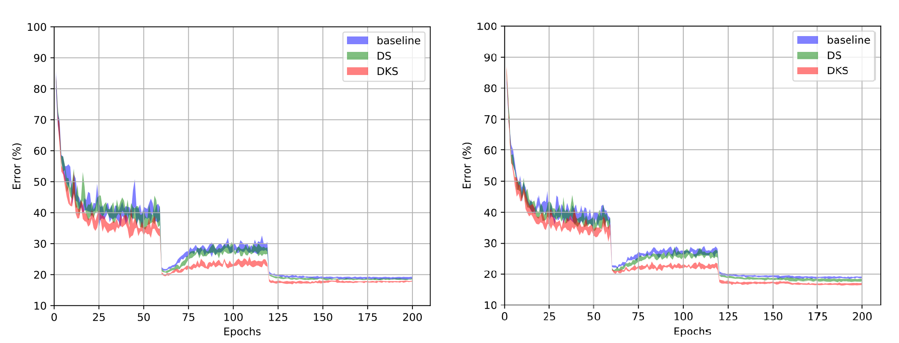
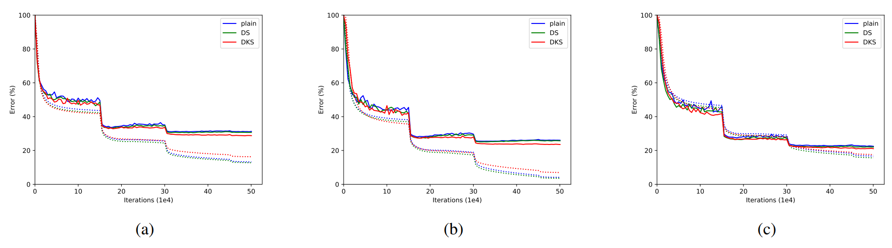

Deeply-Supervised Knowledge Synergy
=============

This code was used for experiments with Deeply-Supervised Knowledge Synergy (CVPR'2019) https://arxiv.org/abs/1906.00675 by Dawei Sun, Anbang Yao, Aojun Zhou, and Hao Zhao. This code is based on the official pytorch implementation of WRN (https://github.com/szagoruyko/wide-residual-networks/tree/master/pytorch).

Modern Convolutional Neural Networks (CNNs) have more complicated blocks stacked with greatly increased depth compared with the pioneering 8-layer AlexNet. However, current prevailing training scheme follows the previous way of adding supervision to the last layer of the network only and propagating error information up layer-by-layer. In this paper, we propose Deeply-supervised Knowledge Synergy (DKS), a new method aiming to train CNNs with improved generalization ability for image classification tasks without introducing extra computational cost during inference. Inspired by the deeply-supervised learning scheme, we first append auxiliary supervision branches on top of certain intermediate layers during network training. While using auxiliary supervision can improve model accuracy to some degree, we go one step further to explore the possibility of utilizing the knowledge (i.e., the class probability over the training data) generated from the auxiliary classifiers and the classifier connected to the last layer as a new regularization to improve CNN training. A novel synergy loss, which considers pairwise knowledge matching among all supervision branches, is presented. Intriguingly, dense pairwise knowledge matching operations are conducted in both top-down and bottom-up directions at each training iteration, resembling a dynamic synergy process for the same task. We evaluate the proposed method on image classification datasets using state-of-the-art CNN architectures. Extensive experiments show that the models trained with our DKS are consistently better than their corresponding counterparts.

Test error (%, mean +/- std over 5 runs) on CIFAR-100:

Network          |   baseline   |      DKS     |
-----------------|:------------:|:-------------:
WRN-28-10        |18.72 +/- 0.24|17.24 +/- 0.22
WRN-28-10-dropout|18.64 +/- 0.19|16.71 +/- 0.17

Test error (%, Top-1/Top-5) on ImageNet:

Network   |   baseline  |    DKS     |
----------|:-----------:|:-----------:
ResNet-18 | 31.06/11.13 | 28.68/9.55
ResNet-50 | 25.47/7.58  | 23.53/6.40
ResNet-152| 22.45/5.94  | 20.98/5.28

See https://arxiv.org/abs/1906.00675 for details.



*Figure 1: Error rate of WRNs on CIFAR-100. (left: WRN-28-10, right: WRN-28-10-dropout. We plot the range over 5 runs.)*

<br>



*Figure 2: Error rate of ResNets on ImageNet. (a): ResNet-18, (b): ResNet-50, (c): ResNet-152. (For ResNet-152, we use stronger data augmentation.)*
<br>

bibtex:
```
@inproceedings{Sun2019DKS,
  title={Deeply-Supervised Knowledge Synergy},
  author={Sun, Dawei and Yao, Anbang and Zhou, Aojun and Zhao, Hao},
  booktitle={Proceedings of the IEEE conference on computer vision and pattern recognition},
  year={2019}
}
```

# Pretrained Models
ResNet-18 (45M): [Download from Google Drive](https://drive.google.com/file/d/1P5QA_uLyaqaSDUCVb0Kkg-UlvVoBJphc/view?usp=sharing)

ResNet-50 (98M): [Download from Google Drive](https://drive.google.com/file/d/1sqhBPdzHi-X0svyBeFWEjiqveWfAohdK/view?usp=sharing)

ResNet-152 (231M): [Download from Google Drive](https://drive.google.com/file/d/1zoCNTuSI0dG2JUjTLFc5vjFodVPPi6C7/view?usp=sharing)

# Usage

### Install requirements

```
pip install -r requirements.txt
```

### Train WRN-28-10-DKS

```
cd wrn_DKS/
mkdir logs
# train wrn-28-10
python main.py --save ./logs/wrn-28-10 --depth 28 --width 10 --dataroot [path to the CIFAR dataset]
# train wrn-28-10 with dropout
python main.py --save ./logs/wrn-28-10_dropout --depth 28 --width 10 --dropout --dataroot [path to the CIFAR dataset]
```

### Run testing on ImageNet
1. Download the pretrained model.
2. Prepare the validation set following [this](https://github.com/pytorch/examples/tree/master/imagenet#requirements).
3. Run the following command:

 ```
 cd imagenet/
 python main.py -a [resnet18/50/152] --model_path [path to the pretrained model] [ImageNet folder with the val subfolder]
 ```

